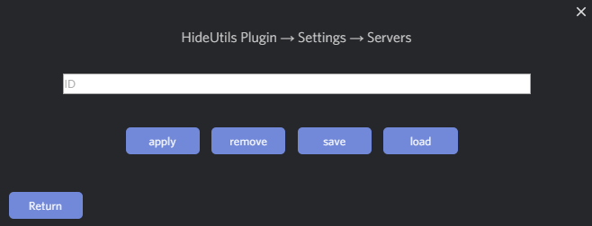

# HideUtils
### A combination plugin featuring hideUsers, hideChannelsPerServer, and hideServers, all rolled into one with some refactoring.

## Download
**[Click me!](https://betterdiscord.net/ghdl?id=1169)**

## New features
- Added context-menu compatibility; can now right-click and hide things.
- New settings UI.
### v1.1.5
- Improved the settings UI to allow for simpler & more flexible removals.

## Preview
### Settings hub-page:

### Settings page:

### Context-menus:

